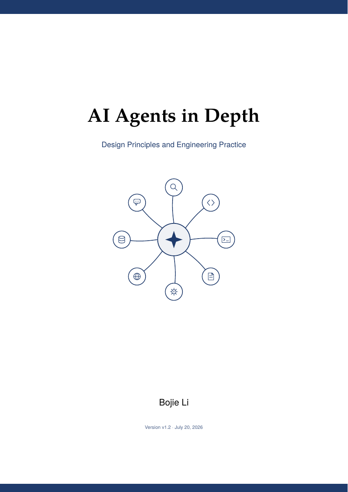

# AI Agents in Depth — русский интерактивный дипдайв

Неофициальная русскоязычная учебная адаптация книги Бодзе Ли **«AI Agents in Depth: Design Principles and Engineering Practice»**. Материал переводит технический английский на русский и превращает содержание книги в интерактивную страницу с концепциями, схемами, глоссарием и вопросами для активного повторения.

> Это не официальное русское издание и не замена оригинальной книге. Для полного контекста, актуальных исправлений и примеров кода обращайтесь к первоисточнику.



## Открыть дипдайв

Скачайте или клонируйте репозиторий и откройте файл [`ai-agents-in-depth.html`](ai-agents-in-depth.html) в браузере. Страница работает локально без сервера и внешних зависимостей.

```bash
git clone https://github.com/radionov-n/ai-agents-in-depth-ru.git
cd ai-agents-in-depth-ru
open ai-agents-in-depth.html
```

На Linux вместо `open` можно использовать `xdg-open`, а на Windows — открыть HTML-файл через проводник.

## Что внутри

- 3 части и 9 тематических разделов;
- 53 технические концепции с русскими объяснениями;
- 53 визуальные модели на inline SVG и CSS;
- проверенные цитаты из книги;
- глоссарий из 29 терминов с поиском;
- 15 вопросов для активного повторения;
- переключатель русского и английского языков;
- отдельные аналитические заметки по каждому разделу;
- адаптивная тёмная страница, работающая на десктопе и мобильных устройствах.

Основные темы: архитектура Agent = LLM + Context + Tools, Harness engineering, ReAct, контекст и KV Cache, память и RAG, MCP и инструменты, coding agents, оценивание, постобучение, самоэволюция, мультимодальные агенты и мультиагентные системы.

## Структура репозитория

```text
.
├── ai-agents-in-depth.html   # готовая интерактивная страница
├── book.json                 # структурированные данные дипдайва
├── assets/                   # обложка
├── i18n/                     # двуязычные данные по разделам
└── sources/                  # аналитические заметки и проверка источников
```

## Первоисточник и авторство

Оригинальная книга и её исходные материалы:

- **Автор:** Bojie Li (Бодзе Ли)
- **Оригинальный репозиторий:** [bojieli/ai-agent-book](https://github.com/bojieli/ai-agent-book)
- **Лицензия первоисточника:** Apache License 2.0
- **Использованная версия:** английский перевод v1.2; перевод английской версии указан в оригинальном репозитории как community contribution by Devaraj.

Оригинальный репозиторий содержит полный текст книги, PDF на нескольких языках и сопровождающие примеры. Все права на исходную книгу принадлежат её автору и участникам оригинального проекта.

## Как был создан дипдайв

Материал собран в Codex с помощью адаптированного скилла `book-deepdive`, основанного на проекте:

- [mldogs/skill-factory](https://github.com/mldogs/skill-factory) — коллекция скиллов для преобразования книг и подкастов в интерактивные учебные материалы;
- исходный `skill-factory` распространяется по лицензии MIT.

В процессе были выполнены тематическое картирование книги, технический перевод, независимая проверка ключевых утверждений, редактура терминологии, построение схем и браузерная проверка результата.

## Изменения относительно первоисточника

Этот репозиторий содержит созданную на основе книги производную учебную работу:

- перевод и техническую адаптацию объяснений на русский язык;
- сокращённую тематическую структуру вместо постраничного воспроизведения книги;
- авторские резюме, аналогии, схемы и визуальные модели;
- глоссарий и вопросы для самопроверки;
- двуязычный интерактивный HTML-интерфейс.

Подробная атрибуция приведена также в файле [`NOTICE`](NOTICE). Копия лицензии первоисточника находится в [`THIRD_PARTY_LICENSES/Apache-2.0.txt`](THIRD_PARTY_LICENSES/Apache-2.0.txt).

## Лицензия

Собственный код, структура, интерфейс и оригинальные дополнения этого репозитория распространяются по [MIT License](LICENSE).

Исходная книга и основанные на ней фрагменты сохраняют условия Apache License 2.0; её копия находится в [`THIRD_PARTY_LICENSES/Apache-2.0.txt`](THIRD_PARTY_LICENSES/Apache-2.0.txt). Репозиторий `mldogs/skill-factory` лицензирован отдельно по MIT License.
